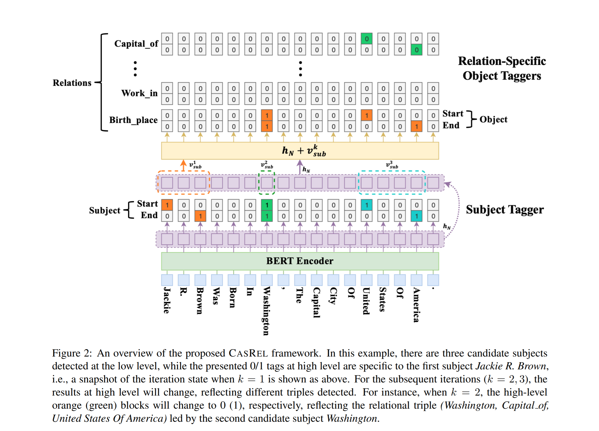

# 一、项目介绍 
CasRel三元组抽取模型
#### 什么是层叠式指针标注？

构造一个 $$sentence\_len * 2$$ 的矩阵，一行表示实体的头，一行表示尾，只将头尾的对应索引位置标为1，其他索引都为0。那么层叠式指针标注其实就是构造多个 $$sentence\_len * 2$$ 的矩阵进行叠加了，有多少个关系就有多少个 $$sentence\_len * 2$$ 的矩阵。

#### 模型结构

首先看一下论文中的示意图



模型首先在输入的句子中识别三元组 SPO 中的所有 subject，然后，针对候选subject 和所有关系进行一一匹配判断，看是否有 object 存在。

1. **Subject Tagger** 

通过 BERT 的输出向量来直接识别所有可能的 subject，上图中 $$h_N$$ 表示经过N层的BERT后的输出向量。由于每一层都是 $$sentence\_len * 2$$ 的矩阵，也就是针对每个 token 都有两个二分类，用来判断该索引位置的 tag 是 0 还是 1。
如果识别到多个 subject，那么将识别到的 start 和 end 按就近原则进行组合成 span，如上图例子所示，第一个 start 是 jackie，第一个 end 是 brown，那么组成的一个实体将是 “jackie r. brown”。

2. **Relation-specific Object Taggers**

提取到subject 之后，遍历每个关系，然后判断subject 和特定的predicate是否有 obejct。


# 二、Requirements
- torch==1.8.0+cu111
- transformers==4.3.3
- fastNLP==0.6.0
- tqdm==4.59.0
- numpy==1.20.1
# 三、Dataset
I preprocessed the open-source dataset from Baidu. I did some cleaning, so the data given have 18 relation types. 
Some noisy data are eliminated.

The data are in form of json. Take one as an example:
```json
{
    "text": "陶喆的一首《好好说再见》推荐给大家，希望你们能够喜欢",
    "spo_list": [
        {
            "predicate": "歌手",
            "object_type": "人物",
            "subject_type": "歌曲",
            "object": "陶喆",
            "subject": "好好说再见"
        }
    ]
}
```

# 四、项目运行方式
```
python run.py
```


